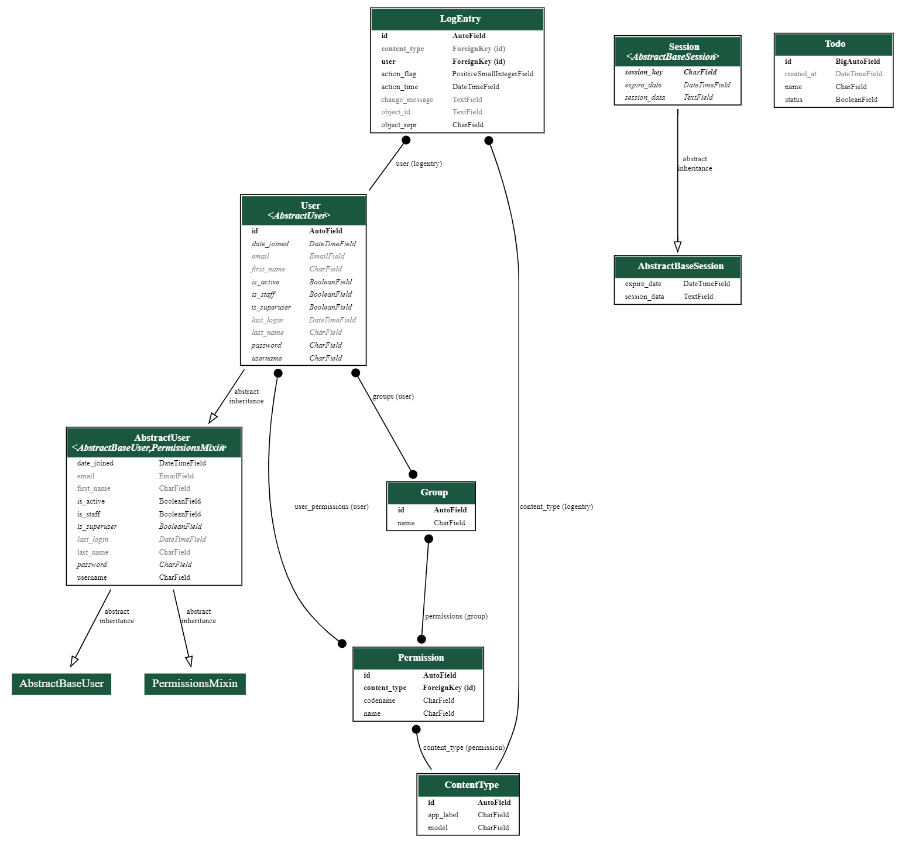
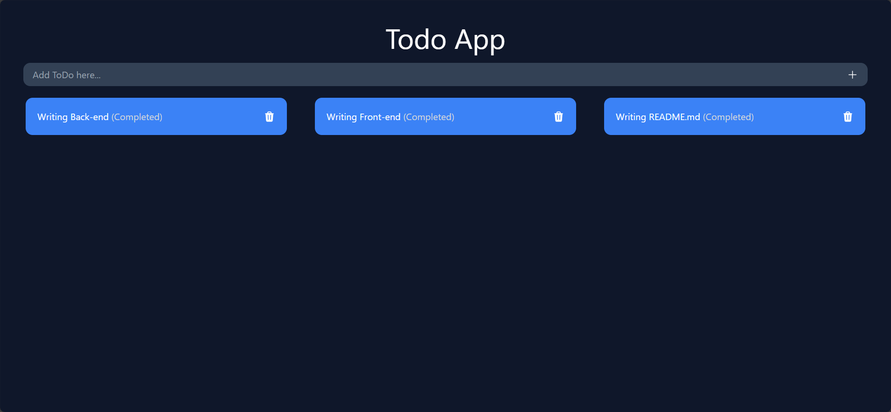

# Todo_app

This repository contains a Todo application developed using Python (Django), Django REST framework, Node.js, React, Tailwind CSS, PostCSS, Autoprefixer, and @heroicons/react. The project is structured with two main folders: `backend_api` for the Django backend and `frontend` for the React frontend.

## Detailed Description

The Todo application is a simple task management tool that allows users to add, edit, and delete tasks. The backend, built with Python using the Django framework, provides a RESTful API for managing Todo items. The frontend, developed with React and styled with Tailwind CSS, offers a user-friendly interface to interact with the Todo application.

## Features

- Add new Todo items.
- View the list of existing Todo items.
- Edit the name and status (completed/incomplete) of Todo items.
- Delete Todo items.

## List of Technologies

| Technology                   | Purpose                      |
| ----------------------------- | ---------------------------- |
| Python (Django)               | Backend development          |
| Django REST framework         | RESTful API for backend       |
| Node.js                       | JavaScript runtime           |
| React                         | Frontend library             |
| Tailwind CSS                  | CSS framework                |
| PostCSS                       | CSS preprocessor             |
| Autoprefixer                  | CSS vendor prefixing tool    |
| @heroicons/react              | SVG icons for React          |
| Axios                         | HTTP client for making requests |

## Graph Demonstration

## Preview

